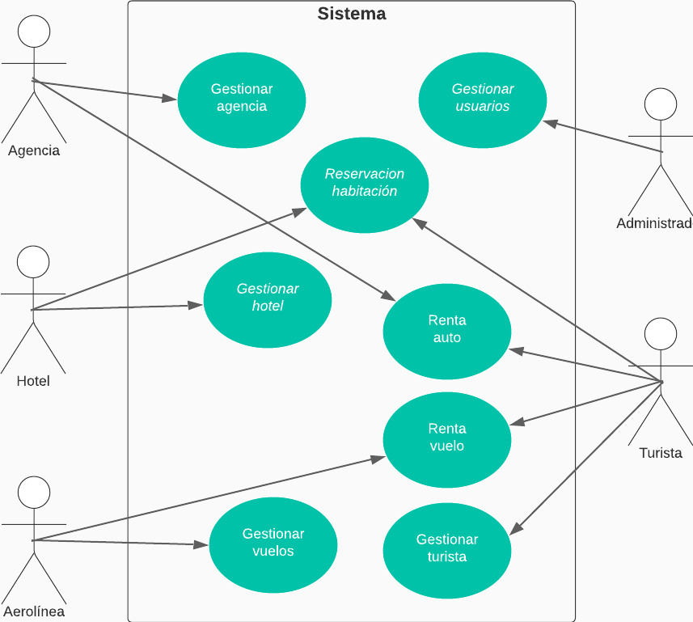

# CASO DE USO ALTO NIVEL

|CDU - 001 - Reservacion Habitacion|
|---|
|Actores: Hotel|
|Tipo: Primario|
|
 Descripción: El Hotel puede agregar servicios de habitaciones disponibles por fechas segùn ocupacion, tambien puede modificar sus servicios y puede inhabilitar sus servicios.
|

|CDU - 002 - Gestionar Usuarios|
|---|
|Actores: Administrador|
|Tipo: Primario|
|
 Descripción: El administrador puede crear usuarios tercerizados.
|

|CDU - 003 - Reservación Habitación|
|---|
|Actores: Hotel, Turista|
|Tipo: Primario|
|
 Descripción: El hotel puede registrar su reservación para su control. El usuario turista puede buscar hoteles en el país y ciudad al que viajará, así como con la cantidad de personas y los rangos de precios y fecchas en las que viajará.
|

|CDU - 004 - Gestionar Agencia|
|---|
|Actores: Auto-Renta|
|Tipo: Primario|
|
 Descripción: El que administre la agencia de autos puede ingresar carros para renta teniendo las características como marca, placa, modelo y precio.
|

|CDU - 005 - Renta Auto|
|---|
|Actores: Agencia, Turista|
|Tipo: Primario|
|
 Descripción: La agencia puede rentar autos a los usuarios turistas, registrando la renta para su control. El turista puede rentar autos por tipo de marca, modelo y rango de precios.
|

|CDU - 006 - Gestionar Vuelos|
|---|
|Actores: Aerolínea|
|Tipo: Primario|
|
 Descripción: La aerolínea controla la cuenta de los turistas, puede agregar vuelos, horarios o incluso cancelar vuelos.
|

|CDU - 007 - Renta Vuelo|
|---|
|Actores: Aerolínea, Turista|
|Tipo: Primario|
|
 Descripción: El turista selecciona una aerolínea entre la varidad que posee el sistema, escoge el destino de su vuelo junto con su horario y la cantidad de asientos que necesita.
|

|CDU - 008 - Gestionaar Turista|
|---|
|Actores: Turista|
|Tipo: Primario|
|
 Descripción: El usuario turista puede hacer viajes a cualquier parte del mundo, rentar autos, reservar vuelos, rentar habitaciones y ver reseñas.
|

[Regresar al Menú](menú.md)