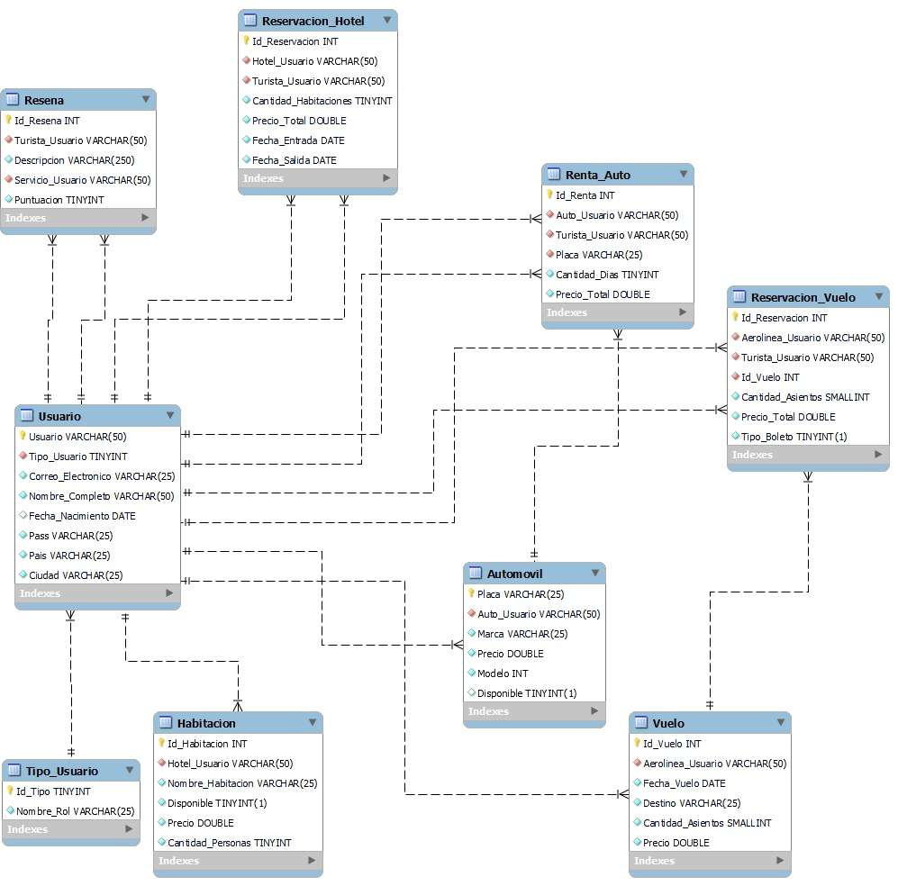

# Diagrama Entidad - Relacion

_El diagrama Entidad - Relacion a utilizar en la creacion de nuestro proyeto, donde definiremos la fase conceptual de nuestra base de datos, esta consta de todas las entidades abtraidas del enunciado, los atributos clave indentificados y las diversas relaciones entre las mismas_

## Fase 1

***
## Fase 2
