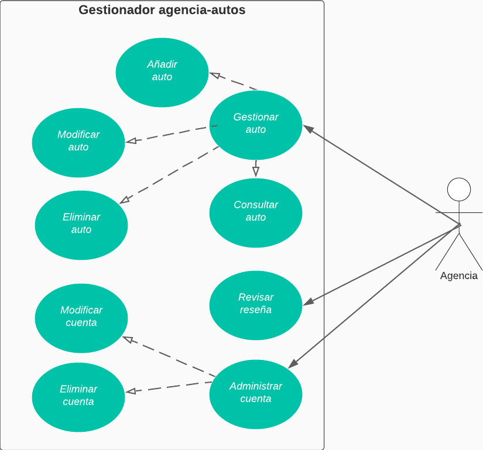

# CASO DE USO EXTENDIDO ADMINISTRAR AUTOMÓVILES

|CDU - 001 - Gestionar auto
|---|
|Actores: Agencia.
|Tipo: Primario
|Propósito: Administra lo autos.
|Resumen: La agencia puede agregar, modificar con diferentes caraterísticas como marca, modelo, placa y precio.
|Referencia Cruzada: N/A
|Curso Normal de Eventos: <ol> <li> Ingresa al sistema. </li> <li> Se dirige al modulo de gestionar auto. </li> <li> Procede a realizar las acciones correspondientes. </li> </ol>
|Curso Alternativo: <ul> <li> Línea 1: Sin conexión en la red. </li></ul>

|CDU - 002 - Añadir auto
|---|
|Actores: Agencia.
|Tipo: Primario
|Propósito: Agregra autos.
|Resumen: Puede agregar autos de distintas marcas para ser rentados.
|Referencia Cruzada: Extensión de Gestionar Automóvil.
|Curso Normal de Eventos: <ol> <li> Ingresa al sistema. </li> <li> Se dirige al modulo de gestionar automóvil. </li> <li> Posteriormente pasa al modulo de agregar automóvil. </li> <li> Ingresa los datos correspondientes del auto para ser agregado. </li> <li> Se guarda los datos nuevos. </li></ol>
|Curso Alternativo: <ul> <li> Línea 1: Sin conexión en la red. </li> <li> Línea 4: Ingresa mal información. </li></ul>

|CDU - 003 - Modificar Auto
|---|
|Actores: Agencia.
|Tipo: Primario
|Propósito: Modificas auto.
|Resumen: Se puede modificar la información del auto.
|Referencia Cruzada: Extensión de Gestionar Automóvil.
|Curso Normal de Eventos: <ol> <li> Ingresa al sistema. </li> <li> Se dirige a gestionar automóvil. </li> <li> Posteriormente pasa al modulo de modificar automóvil. </li> <li> Ingresa los datos del auto que se modificarán. </li> <li> Se guardan los cambios. </li></ol>
|Curso Alternativo: <ul> <li> Línea 1: Sin conexión en la red. </li> <li> Línea 4: Se ingresan datos incorrectos. </li></ul>

|CDU - 004 - Eliminar auto
|---|
|Actores: Agencia.
|Tipo: Primario
|Propósito: Eliminar auto.
|Resumen: Elimina algún auto.
|Referencia Cruzada: Extensión de Gestionar Automóvil.
|Curso Normal de Eventos: <ol> <li> Ingresa al sistema.</li><li> Se dirige al modulo de gestionar automóvil.</li><li> Posteriormente pasa al modulo de eliminar auto.</li><li> Ingresa la información del auto que se debe eliminar. </li><li> Se guardan los cambios.</li></ol>
|Curso Alternativo: <ul> <li> Línea 1: Sin conexión en la red. </li> <li> Línea 4: Se ingresan mal los datos del auto a eliminar.</li></ul>

|CDU - 005 - Consultar Auto
|---|
|Actores: Agencia.
|Tipo: Primario
|Propósito: Consulta algún auto.
|Resumen: Se consultan los datos como marca, modelo, placa o precio del auto.
|Referencia Cruzada: Extensión de Gestionar Automóvil.
|Curso Normal de Eventos: <ol> <li> Ingresa al sistema.</li><li> Se dirige al modulo de gestionar automóvil.</li><li> Posteriormente se dirige al modulo de consultar auto.</li><li> Se muetra la información obtenida del auto. </li></ol>
|Curso Alternativo: <ul> <li> Línea 1: Sin conexión en la red. </li> <li> Línea 4:No se puede visualizar la información.</li></ul>

|CDU - 006 - Administrar Cuenta
|---|
|Actores: Agencia.
|Tipo: Primario
|Propósito: Administra la cuenta del sistema FULL-TRIP.
|Resumen: Se puede solicitar informacion de la cuenta o incluso eliminarla.
|Referencia Cruzada: N/A
|Curso Normal de Eventos: <ol> <li> Ingresa al sistema. </li> <li> Se dirige al modulo de administrar cuenta. </li> <li> Se realizan las acciones correspondientes. </li></ol>
|Curso Alternativo: <ul> <li> Línea 1: Sin conexión en la red. </li></ul>

|CDU - 007 - Modificar Cuenta
|---|
|Actores: Agencia.
|Tipo: Primario
|Propósito: Modifica informacion de la cuenta.
|Resumen: La agencia puede hacer una solicitud para poder modificar su cuenta.
|Referencia Cruzada: Extensión de Gestionar Cuenta.
|Curso Normal de Eventos: <ol> <li> Ingresa al sistema.</li><li> Se dirige al modulo de administrar cuenta.</li><li> Posteriormente pasa al modulo de modificar cuenta.</li><li> Se ingresan los datos de la cuenta que deben modificar. </li> 
|Curso Alternativo: <ul> <li> Línea 1: Sin conexión en la red. </li> <li> Ingresa erroneamente la información para modificar.</li>

|CDU - 008 - Eliminar Cuenta
|---|
|Actores: Agencia.
|Tipo: Primario
|Propósito: Elimina su cuenta.
|Resumen: Se hace solicitud para poder eliminar su cuenta.
|Referencia Cruzada: Extensión de Gestionar Cuenta.
|Curso Normal de Eventos: <ol> <li> Ingresa al sistema.</li><li> Se dirige al modulo de administrar cuenta.</li><li> Posteriormente pasa al modulo de eliminar cuenta.</li><li> Se envía la solicitud para eliminar la cuenta. </li> </ol>
|Curso Alternativo: <ul> <li> Línea 1: Sin conexión en la red. </li><li> Línea 4: La solicitud no se completó.</li></ul>

|CDU - 009 - Revisar Reseñas
|---|
|Actores: Agencia.
|Tipo: Primario
|Propósito: Revisa reseñas.
|Resumen: Puede revisar o visualizar la información de las reseñas.
|Referencia Cruzada: N/A
|Curso Normal de Eventos: <ol> <li> Ingresa al sistema.</li><li> Se dirige al modulo de revisar reseñas.</li><li> Posteriormenta pasa a visualizar las reseñas y la información que contienen.</li> </ol>
|Curso Alternativo: <ul> <li> Línea 1: Sin conexión en la red. </li><li> Línea 3: No se pueden ver las reseñas..</li></ul>

[Regresar al Menú](menú.md)