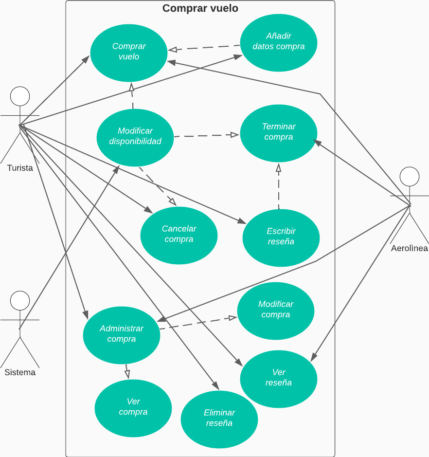

# CASO DE USO EXTENDIDO COMPRAR VUELO

|CDU - 001 - Comprar Vuelo|
|---|
|Actores: Turista, Aerolínea.|
|Tipo: Primario|
|Propósito: El turista compra un vuelo.|
|Resumen: El turista compra un vuelo.|
|Referencia Cruzada: N/A|
|Curso Normal de Eventos: <ol> <li> El turista navega en el sistema. </li> <li> El turista va al apartado de comprar vuelo. </li> <li> El turista realiza la compra. </li> <li> El turista confirma su compra. </li>  <li> La aerolínea confirma la compra. </li></ol>
|Curso Alternativo: <ul> <li> Línea 1: sin conexión a la red. </li> <li> Línea 4: El turista no confirma la compra. </li> <li> Línea 6: La aerolínea no guarda la compra. </li> </ul>

|CDU - 002 - Añadir datos compra|
|---|
|Actores: Turista.|
|Tipo: Primario|
|Propósito: El turista ingresa información del tipo de vuelo que elegirá.|
|Resumen: El turista ingresa información requerida para la compra del vuelo.|
|Referencia Cruzada: Inclusión Compra vuelo.|
|Curso Normal de Eventos: <ol> <li> El turista navega en el sistema. </li> <li> El turista va al aparta de compra vuelo. </li> <li> El turista ingresa la información requerida. </li> </ol>
|Curso Alternativo: <ul> <li> Línea 1: Sin conexión a la red. </li> <li> Línea 3: El turista no ingresa bien la informacion. </li></ul>

|CDU - 003 - Modificar Disponibilidad|
|---|
|Actores: Sistema.|
|Tipo: Primario|
|Propósito: El sistema modifica la dispoinibilidad de los asientos.|
|Resumen: El sistema modifilca la disponibilidad de los asientos del vuelo.|
|Referencia Cruzada: Inclusión Comprar Vuelo.|
|Curso Normal de Eventos: <ol> <li> El turista navega en el sistema. </li> <li> Realiza la compra. </li> <li> El sistema cambia la disponibilidad. </li></ol>
|Curso Alternativo: <ul> <li> Línea 1: Sin conexión a la red. </li> <li> Línea 3: El sistema no modifica la disponibilidad. </li></ul>

|CDU - 004 - Cancelar Compra|
|---|
|Actores: Aerolínea.|
|Tipo: Primario|
|Propósito: La aerolínea finaliza el vuelo.|
|Resumen: La aerolínea finzaliza el vuelo después de aterrizar.|
|Referencia Cruzada: N/A|
|Curso Normal de Eventos: <ol> <li> La aerolínea navega en el sistema. </li> <li> La aerolínea finaliza el vuelo. </li> <li> El sistema cambia la disponibilidad vuelo. </li> </ol>
|Curso Alternativo: <ul> <li> Línea 1: Sin conexión a la red. </li> <ul>

|CDU - 005 - Escribir Reseña
|---|
|Actores: Turista.
|Tipo: Primario
|Propósito: El turista escribe una reseña.
|Resumen: El turista escribe una reseña al finalizar el vuelo.
|Referencia Cruzada: Inclusión Finalizar Compra
|Curso Normal de Eventos: <ol> <li> La aerolínea finaliza el vuelo. </li> <li> El turista escribe una reseña sobre su experienciao. </li> </ol>
|Curso Alternativo: <ul> <li> Línea 2: Sin conexión a la red.</li> <li> Línea 3: El turista no escribe una reseña sobre su experiencia en el vuelo.</li> </ul>

|CDU - 006 - Cancelar Compra
|---|
|Actores: Turista.
|Tipo: Primario
|Propósito: El turista cancela la compra del vuelo.
|Resumen: El turista cancela la compra del vuelo.
|Referencia Cruzada: N/A
|Curso Normal de Eventos: <ol> <li> El turista navega en el sistema. </li> <li> Se dirige al apartado de cancelar compra. </li> </ol>
|Curso Alternativo: <ul><li> Línea 1: Sin conexión a la red.</li> </ul>

|CDU - 007 - Adminitrar Compra
|---|
|Actores: Turista, Aerolínea.
|Tipo: Primario
|Propósito: El turista y la aerolínea administran la compra.
|Resumen: El turista y la aerolínea administran la compra de vuelos.
|Referencia Cruzada: N/A
|Curso Normal de Eventos: <ol> <li> La aerolínea o el turista navega en el sistema. </li> <li> La aerolínea o el turista realiza las operaciones correspondientes. </li> </ol>
|Curso Alternativo: <ul> <li> Línea 1: Sin conexión a la red. </li></ul>

|CDU - 008 - Ver compra
|Actores: Turista, Aerolínea.
|Tipo: Primario
|Propósito: El turista o la aerolínea ve las compras realizadas.
|Resumen: El turista o la aerolínea ven las compras de los vuelos.
|Referencia Cruzada: Extensión de Gestionar Compra.
|Curso Normal de Eventos: <ol> <li> La aerolínea o el turista navegan en el sistema.</li><li> La aerolínea o el turista va al modulo de ver compra.</li><li> La aerolínea o turista ven las compras. </li></ol>
|Curso Alternativo: <ul> <li> Línea 1: Sin conexión a la red. </li> <li> Línea 4: La aerolínea o turista no pueden ver las compras.</li></ul>

|CDU - 009 - Modificar Compra
|---|
|Actores: Turista, Aerolínea.
|Tipo: Primario
|Propósito: El turista modifica su compra.
|Resumen: El turista o la aerolínea hace cambios en una compra.
|Referencia Cruzada: Extensión de Gestionar Comptra.
|Curso Normal de Eventos: <ol> <li> La aerolínea o el turista navega en el sistema.</li><li> La aerolínea o el turista se dirige al apartado modificar compra.</li><li> La aerolínea o turista realiza los cambios. </li></ol>
|Curso Alternativo: <ul> <li> Línea 1: Sin conexión a la red. </li> <li> Línea 4: La aerolínea o turista noingresan bien la informacion.</li><li> Línea 5: La aerolínea o turista no gurardan los cambios.</li></ul>

|CDU - 010 - Ver reseña
|---|
|Actores: Turista, Aerolínea.
|Tipo: Primario
|Propósito: El turista o la aerolínea ven las reseñas.
|Resumen: El turista puede ver las reseñas que los usuarios turistas han agregado.
|Referencia Cruzada: N/A
|Curso Normal de Eventos: <ol> <li> El turista o la aerolínea navegan en el sistema. </li> <li> El turista o la aerolínea se dirige al apartado de ver reseñas. </li> </ol>
|Curso Alternativo: <ul> <li> Línea 1: Sin conexión a la red. </li> <li> Línea 3: El turista o la aerolínea no pueden ver las reseñas. </li>  </ul>

|CDU - 011 - Eliminar Reseña
|---|
|Actores: Turista.
|Tipo: Primario
|Propósito: El turista elimina la reseña.
|Resumen: El turista elimina la reseña que ecribió sobre su experiencia en el vuelo.
|Referencia Cruzada: N/A
|Curso Normal de Eventos: <ol> <li> El turista navega en el sistema. </li> <li> El turista va al apartado de eliminar reseña. </li> <li> El turista elimina su reseña. </li>  </ol>
|Curso Alternativo: <ul> <li> Línea 1: Sin conexión a la red. </li> <li> Línea 3: No selecciona bien su reseña. </li>  </ul>

[Regresar al Menú](menú.md)