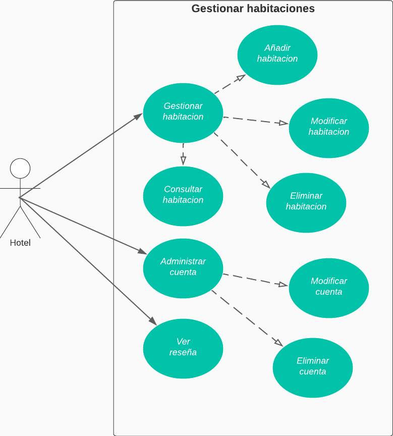

# CASO DE USO EXTENDIDO ADMINISTRAR HABITACIONES

|CDU - 001 - Gestionar Habitación
|---|
|Actores: Hotel.
|Tipo: Primario
|Propósito: El hotel administra las habitaciones.
|Resumen: Agrega, modifica o eliminar habitaciones.
|Referencia Cruzada: N/A
|Curso Normal de Eventos: <ol> <li> Ingresa al sistema. </li> <li> Posteriormente pasa al modulo de gestionar usuarios. </li> </ol>
|Curso Alternativo: <ul> <li> Línea 1: Sin conexión en la red. </li></ul>

|CDU - 002 - Añadir Habitacion
|---|
|Actores: Hotel.
|Tipo: Primario
|Propósito: Agrega habitaciones.
|Resumen: Puede agregar habitaciones para ser reservadas.
|Referencia Cruzada: Extensión de Gestionar Habitación.
|Curso Normal de Eventos: <ol> <li> Ingresa al sistema. </li> <li> Se dirige al modulo de gestionar habitación. </li> <li> Posteriormente pasa al modulo de agregar habitación. </li> <li> Pasa a ingresar la información de la habitación a agregar. </li> </ol>
|Curso Alternativo: <ul> <li> Línea 1: Sin conexión en la red. </li> <li> Línea 4: Se ingresan mal los daotos de la habitación. </li></ul>

|CDU - 003 - Modificar Habitación
|---|
|Actores: Hotel.
|Tipo: Primario
|Propósito: Modificar  habitación.
|Resumen: Se pueden modificar los datos sobre las habitaciones.
|Referencia Cruzada: Extensión de Gestionar Habitación.
|Curso Normal de Eventos: <ol> <li> Ingresa al sistema. </li> <li> Se dirige al modulo de gestionar habitación. </li> <li> Posteriormente pasa al modulo de modificar habitación. </li> <li> Se ingresa la información a modificar de la habitación. </li> <li> Se guardan los cambios realizados. </li></ol>
|Curso Alternativo: <ul> <li> Línea 1: Sin conexión en la red. </li> <li> Línea 4: Se ingresan mal los datos de la habitación. </li></ul>

|CDU - 004 - Eliminar Habitación
|---|
|Actores: Hotel.
|Tipo: Primario
|Propósito: Eliminar habitación.
|Resumen: Se pueden eliminar habitaciones.
|Referencia Cruzada: Extensión de Gestionar Habitación.
|Curso Normal de Eventos: <ol> <li> Ingresa al sistema.</li><li> Se dirige al modulo de gestionar habitación.</li><li> Posteriormente pasas al modulo de eliminar habitación.</li><li> Se escoge que habitacion se quiere eliminar. </li><li> Se guardan los cambios.</li></ol>
|Curso Alternativo: <ul> <li> Línea 1: Sin conexión en la red. </li> <li> Línea 4: Se ingresan mal los datos de la habitación a eliminar.</li></ul>

|CDU - 005 - Consultar Habitación
|---|
|Actores: Hotel.
|Tipo: Primario
|Propósito: Consulta una habitación.
|Resumen: Puede consultar la información de la habitación.
|Referencia Cruzada: Extensión de Gestionar Habitación.
|Curso Normal de Eventos: <ol> <li> Ingresa al sistema.</li><li> Se dirige al modulo de gestionar habitación.</li><li> Posteriormente pasa al modulo de consultar habitación.</li></ol>
|Curso Alternativo: <ul> <li> Línea 1: Sin conexión en la red. </li> <li> Línea 4: No se pueden mostrar los datos de la habitacion. </li></ul>

|CDU - 006 - Administrar Cuenta
|---|
|Actores: Hotel.
|Tipo: Primario
|Propósito: Administra la cuenta del FULL-TRIP.
|Resumen: Puede modificar la informacion de la cuenta.
|Referencia Cruzada: N/A
|Curso Normal de Eventos: <ol> <li> Ingresa al sistema. </li> <li> Se dirige al modulo de administrar cuenta. </li> <li> Posteriormente pasa a realizar las acciones correspondientes. </li></ol>
|Curso Alternativo: <ul> <li> Línea 1: Sin conexión en la red. </li></ul>

|CDU - 007 - Modificar Cuenta
|---|
|Actores: Hotel.
|Tipo: Primario
|Propósito: Modifica informacion de la cuenta.
|Resumen: Puede modificar la cuenta para que el administrador lo realice.
|Referencia Cruzada: Extensión de Gestionar Cuenta.
|Curso Normal de Eventos: <ol> <li> Ingresa al sistema.</li><li> Se dirige al modulo de administrar cuenta.</li><li> Posteriormente pasa al modulo de modificar cuenta.</li><li> Pasa a ingresar la información a modificar. </li> </ol>
|Curso Alternativo: <ul> <li> Línea 1: Sin conexión en la red. </li> <li> Línea 4: Ingresa una información equivocada de la cuenta.</li><li> Línea 5: La solicitud no se envía.</li></ul>

|CDU - 008 - Eliminar Cuenta
|---|
|Actores: Hotel.
|Tipo: Primario
|Propósito: Eliminar cuenta.
|Resumen: Se registra la  solicitud de eliminar cuenta.
|Referencia Cruzada: Extensión de Gestionar Cuenta.
|Curso Normal de Eventos: <ol> <li> Ingresa al sistema.</li><li> Se dirige al modulo de gestionar cuenta.</li><li> Posteriormente pasa al modulo de eliminar cuenta.</li><li> Pasa a enviar la solicitud. </li> </ol>
|Curso Alternativo: <ul> <li> Línea 1: Sin conexión en la red.. </li><li> Línea 4: La solicitud no se envia.</li></ul>

|CDU - 009 - Ver Reseña
|---|
|Actores: Hotel.
|Tipo: Primario
|Propósito: Ve reseñas.
|Resumen: El hotel puede visualizar las reseñas que tiene.
|Referencia Cruzada: N/A
|Curso Normal de Eventos: <ol> <li> Ingresa al sistema.</li><li> Se dirige al modulo de ver reseñas.</li><li> Puede leer todas las reseñas.</li> </ol>
|Curso Alternativo: <ul> <li> Línea 1: Sin conexión en la red. </li><li> Línea 3: No se pueden ver las reseñas.</li></ul>

[Regresar al Menú](menú.md)