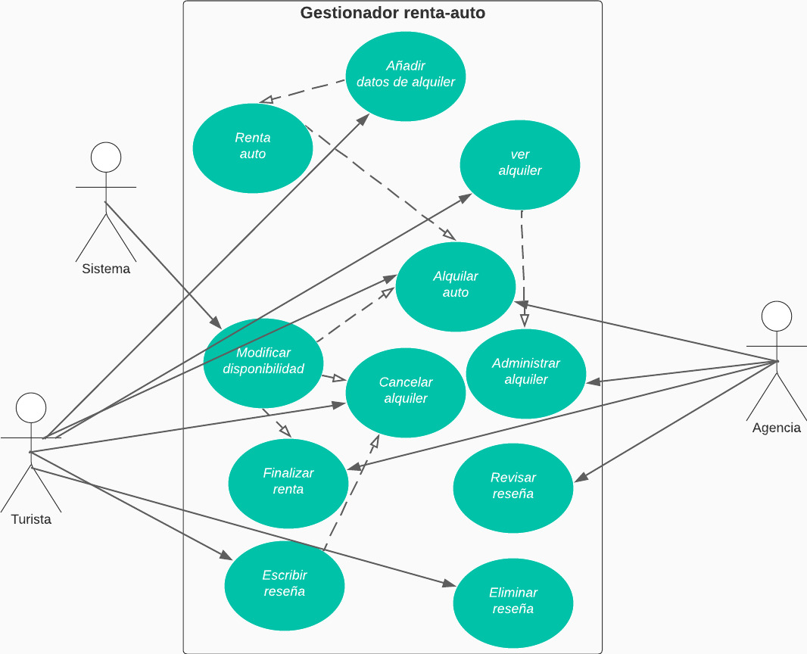

# CASO DE USO EXTENDIDO ALQUILAR AUTOMÓVIL

|CDU - 001 - Renta Auto|
|---|
|Actores: Agencia.|
|Tipo: Primario|
|Propósito: La agencia da autos en renta.|
|Resumen: La agencia pone a disposición del turista autos en renta.|
|Referencia Cruzada: N/A|
|Curso Normal de Eventos: <ol> <li> La agencia ingresa al sistema. </li> <li> Se dirige al modulo de renta auto. </li> <li> Posteriormente se llega a confirmar la renta. </li> <li> El sistema cambia la disponibilidad del automóvil. </li> </ol>
|Curso Alternativo: <ul> <li> Línea 1: Sin conexión en la red. </li> <li> Línea 4: No se confirma la renta. </li> 

|CDU - 002 - Añadir datos de alquiler|
|---|
|Actores: Turista.|
|Tipo: Primario|
|Propósito: Se ingresa información del alquiler.|
|Resumen: Se ingresa la información que se solicita para la renta del auto.|
|Referencia Cruzada: Inclusión Alquilar Automóvil.|
|Curso Normal de Eventos: <ol> <li> Ingresa al sistema. </li> <li> Se dirige al modulo de renta auto. </li> <li> El turista puede ingresar la información necesaria para la renta. </li> </ol>
|Curso Alternativo: <ul> <li> Línea 1: Sin conexión en la red. </li> <li> Línea 3: Se ingresa mal los datos del alquiler. </li></ul>

|CDU - 003 - Modificar disponibilidad|
|---|
|Actores: Sistema.|
|Tipo: Primario|
|Propósito: Se modificar la disponibilidad del sistem|
|Resumen: El sistema modificar la disponibilidad del auto.
|Referencia Cruzada: Inclusión Alquilar Automóvil.|
|Curso Normal de Eventos: <ol> <li> Ingrea al sistema. </li> <li> Se crea y confirma la solicitud de la renta. </li> <li> En el sistema se guarda la disponibilidad. </li></ol>
|Curso Alternativo: <ul> <li> Línea 1: Sin conexión en la red. </li> <li> Línea 3: No se pueden guardar los cambios de la disponibilidad. </li></ul>

|CDU - 004 - Finalizar Renta|
|---|
|Actores: Agencia.|
|Tipo: Primario|
|Propósito: Finaliza el alquiler.|
|Resumen: Se finaliza la renta del auto cuando el turista entrega de nuevo el auto.|
|Referencia Cruzada: N/A|
|Curso Normal de Eventos: <ol> <li> Ingresa al sistema. </li> <li> El auto sale de la agencia. </li> <li> Se finaliza el alquiler. </li> <li>  Se cambia la disponibilidad del auto. </li> </ol>
|Curso Alternativo: <ul> <li> Línea 1: Sin conexión en la red. </li> <li>  No se realiza la renta del auto.</li></ul>

|CDU - 005 - Escribir Reseña
|---|
|Actores: Turista.
|Tipo: Primario
|Propósito: El turista escribe una reseña.
|Resumen: El turista puede escribir una reseña luego de finalizar la renta.
|Referencia Cruzada: Inclusión Finalizar Alquiler
|Curso Normal de Eventos: <ol> <li> El turista sale de las instalaciones con el auto. </li> <li> Se finaliza la renta. </li> <li> El turiste escribe una reseña sobre el auto. </li> </ol>
|Curso Alternativo: <ul> <li> Línea 2: Sin conexión en la red.</li> <li> Línea 3: No se puede escribir una reseña.</li> </ul>

|CDU - 006 - Cancelar Alquiler
|---|
|Actores: Turista.
|Tipo: Primario
|Propósito: Se cancela el alquiler del auto.
|Resumen: Se cancela la renta de un auto que no se usará.
|Referencia Cruzada: N/A
|Curso Normal de Eventos: <ol> <li> Ingresa al sistema. </li> <li> Posteriormente para al modulo de cancelar alquiler. </li> </ol>
|Curso Alternativo: <ul><li> Línea 1: Sin conexión en la red.</li> </ul>

|CDU - 007 - Administrar Alquiler
|---|
|Actores: Turista, Agencia.
|Tipo: Primario
|Propósito: La agencia administra el alquiler.
|Resumen: La agencia administra el alquiler de los autos y puede ver las rentas de los autos.
|Referencia Cruzada: N/A
|Curso Normal de Eventos: <ol> <li> Ingresa al sistema. </li> <li> Posteriormente se dirige al modulo de administrar alquiler. </li></ol>
|Curso Alternativo: <ul> <li> Línea 1: Sin conexión en la red. </li></ul>

|CDU - 008 - Ver Alquiler
|---|
|Actores: Turista.
|Tipo: Primario
|Propósito: El turista ve el alquiler
|Resumen: Puede ver el alquiler de un auto.
|Referencia Cruzada: Extensión de Gestionar Alquiler.
|Curso Normal de Eventos: <ol> <li> Ingresa al sistema.</li><li> Posteriomente pasa al modulo de administrar alquiler.</li><li> Pasa la modulo de visualizar renta.</li></ol>
|Curso Alternativo: <ul> <li> Línea 1: Sin conexión en la red. </li> <li> Línea 4: La agencia no pueden ver las rentas de autos.</li></ul>

|CDU - 009 - Revisar Reseña
|---|
|Actores: Turista, Agencia.
|Tipo: Primario
|Propósito: Pueden revisar reseñas.
|Resumen: Ambas partes pueden revisar las reseñas sobre la renta de los autos.
|Referencia Cruzada: N/A
|Curso Normal de Eventos: <ol> <li> Ingresan al sistema. </li> <li> Posteriormente se dirigen al modulo de revisar reseñas. </li> <li> El turista o la agencia leen las reseñas.</ol>
|Curso Alternativo: <ul> <li> Línea 1: Sin conexión en la red. </li> </ul>

|CDU - 011 - Eliminar Reseña
|---|
|Actores: Turista.
|Tipo: Primario
|Propósito: Puede eliminar la reseña.
|Resumen: El turista puede eliminar la reseña que ha escrito.
|Referencia Cruzada: N/A
|Curso Normal de Eventos: <ol> <li> Ingresa al sistema. </li> <li> Posteriormente se dirige al modulo de eliminar reseña. </li> <li> El turista seleccioa la reseña a eliminar. </li> </ol>
|Curso Alternativo: <ul> <li> Línea 1: Sin conexión en la red. </li> </ul>

[Regresar al Menú](menú.md)