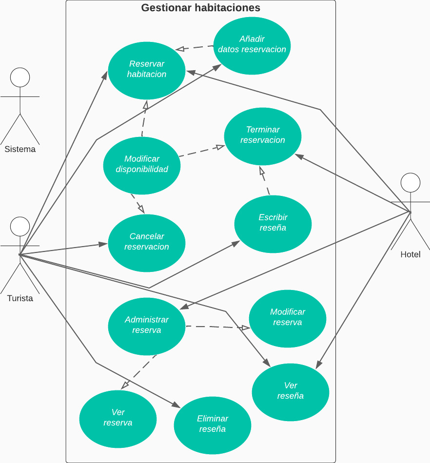

# CASO DE USO EXTENDIDO RESERVAR HABITACION

|CDU - 001 - Reservar Habitación|
|---|
|Actores: Turista, Hotel.|
|Tipo: Primario|
|Propósito: Reserva una habitación.|
|Resumen: Puede reservar las habitaciones que desea.|
|Referencia Cruzada: N/A|
|Curso Normal de Eventos: <ol> <li> Ingresa al sistema. </li> <li> Se dirige al modulo de reservar habitación. </li> <li> Posteriormente para a realiza una reservación. </li> <li> Se confirma la reservacion. </li> <li> Se cambia la disponibilidad de la habitacion y se guarda la reservación. </li> </ol>
|Curso Alternativo: <ul> <li> Línea 1: Sin conexión en la red. </li> <li> Línea 4: No se confirma la reservacion o no se guarda la reservación. </li> </ul>

|CDU - 002 - Añadir Datos Reservación|
|---|
|Actores: Turista.|
|Tipo: Primario|
|Propósito: Ingresa información de la reserva.|
|Resumen: Se puede ingresar la información necesaria para hacer una reservación.|
|Referencia Cruzada: Inclusión Reservar Habitación.|
|Curso Normal de Eventos: <ol> <li> Ingresa al sistema. </li> <li> Se dirige al modulo de reservar habitación. </li> <li> Posteriormente pasa la información que se  necesita  para reservar una habitación. </li> </ol>
|Curso Alternativo: <ul> <li> Línea 1: Sin conexión en la red. </li> </ul>

|CDU - 003 - Modificar Disponibilidad|
|---|
|Actores: Sistema.|
|Tipo: Primario|
|Propósito: Se modifica la dispoinibilidad.|
|Resumen: Se puede modificar la disponibilidad de alguna habitación.|
|Referencia Cruzada: Inclusión Reservar Habitación.|
|Curso Normal de Eventos: <ol> <li> Ingresa al sistema. </li> <li> Posteriormente se confirma la reservacion. </li> <li> En el sistema cambia la disponibilidad. </li></ol>
|Curso Alternativo: <ul> <li> Línea 1: Sin conexión en la red. </li> <li> Línea 3: No se modifica correctamente la disponibilidad. </li></ul>

|CDU - 004 - Terminar Reservación|
|---|
|Actores: Hotel.|
|Tipo: Primario|
|Propósito: Se finaliza la reserva.|
|Resumen: Se puede finzalizar la reservación que haya hecho el turista.|
|Referencia Cruzada: N/A|
|Curso Normal de Eventos: <ol> <li> Ingresa al sistema. </li> <li> Se finaliza la reservacion del turista. </li> <li> Modifica la disponibilidad de la habitación. </li> </ol>
|Curso Alternativo: <ul> <li> Línea 1: Sin conexión en la red. </li> <li>  No se finaliza correctamente la reservación.</li></ul>

|CDU - 005 - Escribir Reseña
|---|
|Actores: Turista.
|Tipo: Primario
|Propósito: Escribe una reseña.
|Resumen: El turista puede escribir una reseña sobre la habitación del hotel.
|Referencia Cruzada: Inclusión Finalizar Reserrva
|Curso Normal de Eventos: <ol> <li> El turista se retira del hotel. </li> <li> Se finaliza la reservacion. </li> <li> El turista escribe una reseña de la habitación del hotel </li> </ol>
|Curso Alternativo: <ul> <li> Línea 2: Sin conexión en la red.</li> <li> Línea 3: No se registra correctamente la reseña hecha por el turista.</li> </ul>

|CDU - 006 - Cancelar Reservación
|---|
|Actores: Turista.
|Tipo: Primario
|Propósito: Cancelar una habitación.
|Resumen: Se puede cancelar la reservación de una habitación.
|Referencia Cruzada: N/A
|Curso Normal de Eventos: <ol> <li> Ingresa al sistema. </li> <li> Pasa al modulo de cancelar reservación. </li> <li> Posteriormente se confirma la cancelación de la reservación. </li></ol>
|Curso Alternativo: <ul><li> Línea 1: Sin conexión en la red.</li> </ul>

|CDU - 007 - Administrar Reserva
|---|
|Actores: Turista, Hotel.
|Tipo: Primario
|Propósito: Administran la reservación.
|Resumen: Puede administrar la reservación, en donde la pueden visualizar y modificarlas.
|Referencia Cruzada: N/A
|Curso Normal de Eventos: <ol> <li> Se ingresa al sistema. </li> <li> Pasan al modulo de gestionar reserva. </li> <li> Posteriormente pasa a realizar las operaciones correspondientes. </li> </ol>
|Curso Alternativo: <ul> <li> Línea 1: Sin conexión en la red. </li></ul>

|CDU - 008 - Ver Reserva
|---|
|Actores: Turista, Hotel.
|Tipo: Primario
|Propósito: Visualiza reserva.
|Resumen: Se pueden ver las reservas de las habitaciones.
|Referencia Cruzada: Extensión de Gestionar Reserva.
|Curso Normal de Eventos: <ol> <li> Ingresan al sistema.</li><li> Se dirige al modulo de gestionar reserva.</li><li> Posteriormente pasa al modulo de visualizar reserva.</li><li> Pasan a visualizar las reservas. </li></ol>
|Curso Alternativo: <ul> <li> Línea 1: Sin conexión en la red. </li> </ul>

|CDU - 009 - Modificar Reserva
|---|
|Actores: Turista, Hotel.
|Tipo: Primario
|Propósito: Modifica una reserva.
|Resumen: Puede modificar la reservación de la habitación.
|Referencia Cruzada: Extensión de Gestionar Reserva.
|Curso Normal de Eventos: <ol> <li> Ingresa al sistema.</li><li> Se dirige al modulo de administrar reserva.</li><li> Posteriormente pasa al modulo de modificar reserva.</li><li> Reralizan los cambios a resalizar. </li><li> Los cambios son guardados. </li></ol>
|Curso Alternativo: <ul> <li> Línea 1: Sin conexión en la red. </li> <li> Línea 4: Mal ingreso de los datos a modificar.</li></ul>

|CDU - 010 - Ver Reseña
|---|
|Actores: Turista, Hotel.
|Tipo: Primario
|Propósito: Ve reseña.
|Resumen: El turista puede ver las reseñas de las habitacioens
|Referencia Cruzada: N/A
|Curso Normal de Eventos: <ol> <li> Ingresan al sistema. </li> <li> Se dirige al modulo de visualizar reseñas. </li> <li> Posteriormente pasan a leer las reseñas.</ol>
|Curso Alternativo: <ul> <li> Línea 1: Sin conexión en la red. </li> <li> Línea 3: Las reseñas no pueden ser vistas. </li>  </ul>

|CDU - 011 - Eliminar Reseña
|---|
|Actores: Turista.
|Tipo: Primario
|Propósito: Elimina reseña.
|Resumen: El turista puede eliminar la reseña que ha escrito.
|Referencia Cruzada: N/A
|Curso Normal de Eventos: <ol> <li> Ingresa al sistema. </li> <li> Se dirige al modulo de eliminar reseña. </li> <li> Posteriormente pasa a eliminar la reseña. </li> <li> Se confirma que la reseña ha sido eliminada. </li> </ol>
|Curso Alternativo: <ul> <li> Línea 1: Sin conexión en la red.</li> </ul>

[Regresar al Menú](menú.md)