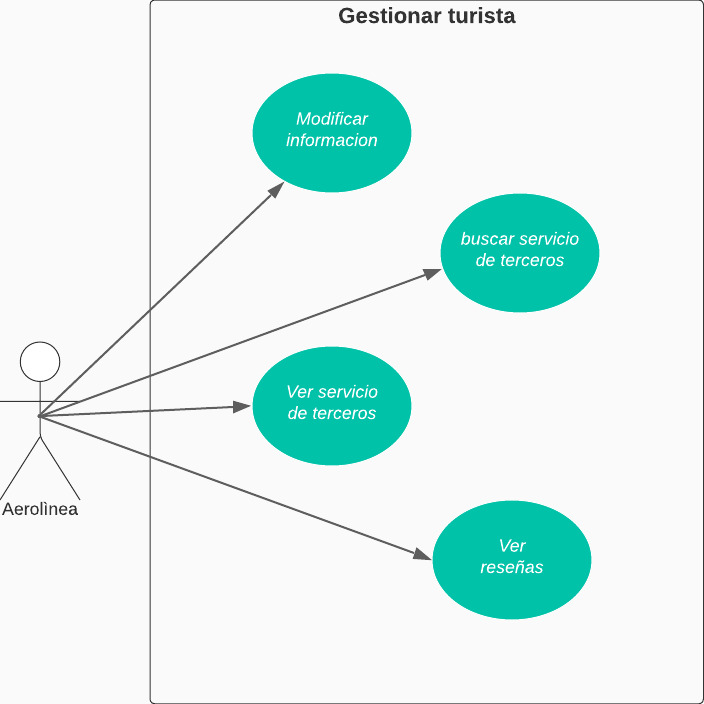

# CASO DE USO EXTENDIDO GESTIONAR TURISTA

|CDU - 001 - Modificar Información
|---|
|Actores: Turista.
|Tipo: Primario
|Propósito: El usuario turista puede actualizar su informacion.
|Resumen: El usuario puede tener su informacion actualizada.
|Referencia Cruzada: N/A
|Curso Normal de Eventos: <ol> <li> El usuario navega en el sistema. </li> <li> El usuario ingrea a su cuenta. </li> <li> El usuario modifica su informacion. </li> <li> El usuario confirma sus cambios. </li> </ol>
|Curso Alternativo: <ul> <li> Línea 1: Sin conexión a la red. </li> <li> Línea 3: El usuario no ingresa la informacion que es. </li>  </ul>

|CDU - 002 - Buscar Servicios de tereros
|---|
|Actores: Turista.
|Tipo: Primario
|Propósito: El usuario busca servicios tercerizados.
|Resumen: El usuario buxca los servicios que necesita.
|Referencia Cruzada: N/A
|Curso Normal de Eventos: <ol> <li> El usuario navega en el sistema. </li> <li> El usuario busca servicios tercerizados. </li> <li> El usuario selecciona el servicio que desea. </li> <li> El usuario puede ver todos los servicios tercerizados buscados. </li></ol>
|Curso Alternativo: <ul> <li> Línea 1: Sin conexión a la red. </li> <li> Línea 4: El usuario no puede ver los servicios que buscó. </li> </ul>

|CDU - 003 - Ver Servicios de terceros
|---|
|Actores: Turista.
|Tipo: Primario
|Propósito: El usuario puede ver sus servicios.
|Resumen: El usuario puede ver todos los servicios que adquirió.
|Referencia Cruzada: N/A
|Curso Normal de Eventos: <ol> <li> El usuario navega en el sistema. </li> <li> El usuario se dirige a los servicios que adquirió. </li> <li> El usuario ve todos los servicios. </li> </ol>
|Curso Alternativo: <ul><li> Línea 1: Sin conexión a la red. </li></ul>

|CDU - 004 - Ver Reseñas
|---|
|Actores: Turista.
|Tipo: Primario
|Propósito: El usuario puede ver las reseñas que escribió.
|Resumen: El usuario puede ver las reseñas de los servicios que adquirió.
|Referencia Cruzada: N/A
|Curso Normal de Eventos: <ol> <li> El usuario naega en el sistema. </li> <li> El usuario se dirige a las reseñas. </li> <li> El usuaio lee  las reseñas. </li> </ol>
|Curso Alternativo: <ul> <li> Línea 1: Sin conexión a la red. </li> </ul>

[Regresar al Menú](menú.md)