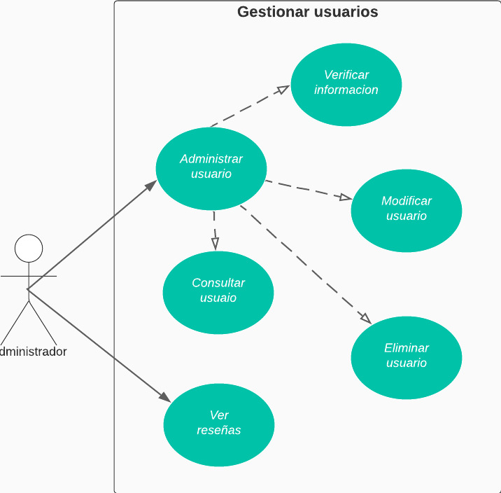

# CASO DE USO EXTENDIDO GESTIONAR USUARIOS

|CDU - 001 - Administrar Usuario
|---|
|Actores: Adminstrador.
|Tipo: Primario
|Propósito: El administrador puede gestionar servicios tercerizados.
|Resumen: El administrador puede agregar, modificiar, eliminar y consultar servicios tercerizados.
|Referencia Cruzada: N/A
|Curso Normal de Eventos: <ol> <li> El administrador navega en el sistema. </li> <li> El administrador va al aparta de administrar usuarios. </li> <li> El administrador realiza las gestiones necesarias. </li> </ol>
|Curso Alternativo: <ul> <li> Línea 1: Sin conexión a la red. </li></ul>

|CDU - 002 - Verificar Información
|---|
|Actores: Adminstrador.
|Tipo: Primario
|Propósito: El administrador agrega un servicio tercerizado.
|Resumen: El administrador acepta o rechaza la información ingresada por el servicio tercerizado..
|Referencia Cruzada: Extensión de Gestionar Usuario.
|Curso Normal de Eventos: <ol> <li> El administrador navega en el sistema. </li> <li> El administrador va al apartado de administrar usuarios. </li> <li> El administrador va al apartado de confirmar información. </li> <li> El administrador lee la información ingresada por los servicios tercerizados. </li> <li> El administrador acepta o rechaza los servicios. </li></ol>
|Curso Alternativo: <ul> <li> Línea 1: Sin conexión a la red. </li> <li> Línea 3: El administrador no puede ver la información. </li> <li> Línea 5: El administrador ingresa erroneamente la decisión tomada. </li>  </ul>

|CDU - 003 - Modificar usuario
|---|
|Actores: Adminstrador.
|Tipo: Primario
|Propósito: El administrador modifica la información del servicio tercerizado.
|Resumen: El administrador Hace cambios en la informacion de los servicios de terceros.
|Referencia Cruzada: Extensión de Gestionar Usuario.
|Curso Normal de Eventos: <ol> <li> El administrador navega en el sistema. </li> <li> El administrador va al aparta de administrar usuario. </li> <li> El administrador va al apartado de modificar usuario. </li> <li> El administrador cambia la información o servicio.</li> <li> El administrado guarda los cambios. </li> </ol>
|Curso Alternativo: <ul> <li> Línea 1: Sin conexión a la red. </li> <li> Línea 4: El administrador no ingresa bien la información a modificar </li>  </ul>

|CDU - 004 - Eliminar Usuario
|---|
|Actores: Adminstrador.
|Tipo: Primario
|Propósito: El administrador elimina servicio tercerizado.
|Resumen: El administrador elimina la cuenta de algun servicio tercerizado.
|Referencia Cruzada: Extensión de Gestionar Usuario.
|Curso Normal de Eventos: <ol> <li> El administrador navega en el sistema. </li> <li> El administrador va al apartado de administrar usuario. </li> <li> El administrador va al apartado de eliminar usuario. </li> <li> El administrador elimina el usuario o servicio seleccionado. </li> <li> El administrado guarda los cambios. </li> </ol>
|Curso Alternativo: <ul> <li> Línea 1: sin conexión a la red. </li> <li> Línea 4: El administrador no selecciona bien lo que desea eliminar. </li>  </ul>

|CDU - 005 - Consultar usuario 
|---|
|Actores: Adminstrador.
|Tipo: Primario
|Propósito: El administrador consulta servicio tercerizado.
|Resumen: El administrador consulta la cuenta del servicio tercerizad.
|Referencia Cruzada: Extensión de Gestionar Usuario.
|Curso Normal de Eventos: <ol> <li> El administrador navega en  el sistema. </li> <li> El administrador va al apartado de administrar usuarios. </li> <li> El administrador va al aparta de buscar un usuario. </li> <li> El administrador ve la informacion del servicio de tercero. </li></ol>
|Curso Alternativo: <ul> <li> Línea 1: Sin conexión a la red. </li> <li> Línea 4: El administrador no puede ver la informacion. </li>  </ul>

|CDU - 006 - Ver Reseñas
|---|
|Actores: Adminstrador.
|Tipo: Primario
|Propósito: El administrador visualiza las reseñas.
|Resumen: El administrador visualiza las reseñas de todos los servicios tercerizados.
|Referencia Cruzada: N/A
|Curso Normal de Eventos: <ol> <li> El administrador navega en el sistema. </li> <li> El administrador se dirige al apartado de reseñas. </li> <li> El administrador lee las reseñas que tienen los servicios tercerizados. </li> </ol>
|Curso Alternativo: <ul> <li> Línea 1: Sin conexión a la red. </li> <li> Línea 3: El administrador no puede ver las reseña. </li>  </ul>

[Regresar al Menú](menú.md)