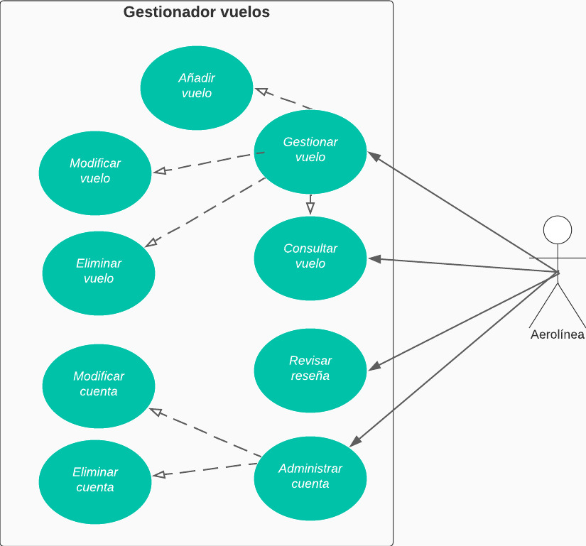

# CASO DE USO EXTENDIDO ADMINISTRAR AEROLÍNEA

|CDU - 001 - Gestionar Vuelo
|---|
|Actores: Aerolínea.
|Tipo: Primario
|Propósito: La aerolínea administra los vuelos.
|Resumen: La aerolínea crea vuelos, disponibilidad y fechas.
|Referencia Cruzada: N/A
|Curso Normal de Eventos: <ol> <li> La aerolínea ingresa al sistema. </li> <li> Se dirige a gestionar usuarios. </li> <li> Realiza las operaciones correspondientes. </li> </ol>

|CDU - 002 - Añadir Vuelo
|---|
|Actores: Aerolínea.
|Tipo: Primario
|Propósito: Agregar vuelo.
|Resumen: Agrega vuelos que pueden ser comprados.
|Referencia Cruzada: Extensión de Gestionar Vuelo.
|Curso Normal de Eventos: <ol> <li> Ingresa al sistema. </li> <li> Se dirige al modulo de gestionar vuelo. </li> <li> Procede a agregar vuelo. </li> <li> Pasa a ingresar la información del vuelo. </li> <li> Guarda los cambios. </li></ol>
|Curso Alternativo: <ul> <li> Línea 1: La red no tiene conexión. </li> <li> Línea 4: Da mala información del vuelo. </li></ul>

|CDU - 003 - Modificar Vuelo
|---|
|Actores: Aerolínea.
|Tipo: Primario
|Propósito: Modificar datos del vuelo.
|Resumen: La aerolínea puede modificar información correspondiente de un vuelo.
|Referencia Cruzada: Extensión de Gestionar Vuelo.
|Curso Normal de Eventos: <ol> <li> Ingresa al sistema. </li> <li> Se dirige a gestionar vuelo. </li> <li> Posteriormente se dirige a modificar vuelo. </li> <li> Ingresa la información del vuelo que se modificará. </li> <li> Guarda los cambios. </li></ol>
|Curso Alternativo: <ul> <li> Línea 1: Sin conexión en la red. </li> <li> Línea 4: Ingresa informacion erronea a modificar. </li></ul>

|CDU - 004 - Eliminar Vuelo
|---|
|Actores: Aerolínea.
|Tipo: Primario
|Propósito: Elimina un vuelo.
|Resumen: La aerolínea puede eliminar vuelos.
|Referencia Cruzada: Extensión de Gestionar Vuelo.
|Curso Normal de Eventos: <ol> <li> Ingresa al sistema.</li><li> Se dirige al modulo de gestionar vuelo.</li><li> Posteriormente procede al modulo de eliminar vuelo.</li><li> Ingresa los datos del vuelo que se eliminará. </li><li> Guarda los cambios.</li></ol>
|Curso Alternativo: <ul> <li> Línea 1: Sin conexión en la red. </li> <li> Línea 4: Ingresa informacion erronea del vuelo que se eleminará.</li></ul>

|CDU - 005 - Consultar Vuelo
|---|
|Actores: Aerolínea.
|Tipo: Primario
|Propósito: Consulta vuelo.
|Resumen: Puede consultar la de un  vuelo.
|Referencia Cruzada: Extensión de Gestionar Vuelo.
|Curso Normal de Eventos: <ol> <li> Ingresa al sistema.</li><li> Se dirige al modulo de gestionar vuelo.</li><li> Posteriormente procede al modulo de consultar vuelo.</li><li> Visualiza la infromación sobre el vuelo. </li></ol>
|Curso Alternativo: <ul> <li> Línea 1: Sin conexión en la red. </li> <li> Línea 4: No se puede ver informacion sobre el vuelo.</li></ul>

|CDU - 006 - Administrar Cuenta
|---|
|Actores: Aerolínea.
|Tipo: Primario
|Propósito: Administra la cuenta del sistema FULL-TRIP.
|Resumen: Puede solicitar la informacion para modificala, eliminarla o visualizarla.
|Referencia Cruzada: N/A
|Curso Normal de Eventos: <ol> <li> Ingresa al sistema. </li> <li> Se dirige al modulo de administrar cuenta. </li> <li> Realiza las consultas que desea.
 </li></ol>
|Curso Alternativo: <ul> <li> Línea 1: Sin conexión en la red. </li></ul>

|CDU - 007 - Modificar Cuenta
|---|
|Actores: Aerolínea.
|Tipo: Primario
|Propósito: La aerolínea modifica informacion de su cuenta.
|Resumen: La aerolínea solicita la modificacion de su cuenta para que el administrador lo realice.
|Referencia Cruzada: Extensión de administrar Cuenta.
|Curso Normal de Eventos: <ol> <li> Ingresa al sistema.</li><li> Se dirige al modulo de administrar cuenta.</li><li> Posteriormente se dirige al modulo de modificar cuenta.</li><li> Procede a  ingresa la información del vuelo que se modificará. </li> <li> Se envía la solicitud. </li> </ol>
|Curso Alternativo: <ul> <li> Línea 1: Sin conexión en la red. </li> <li> Línea 4: La aerolínea se equivoca al ingresar la información.</li><li> Línea 5: La solicitud no es enviada.</li></ul>

|CDU - 008 - Eliminar Cuenta
|---|
|Actores: Aerolínea.
|Tipo: Primario
|Propósito: Elimina cuenta.
|Resumen: Se ingresa la informacion sobre la cuenta que se eliminará.
|Referencia Cruzada: Extensión de administrar Cuenta.
|Curso Normal de Eventos: <ol> <li> Ingresa al sistema.</li><li> Se dirige al modulo de gestionar cuenta.</li><li> Posteriormete pasa al modulo de eliminar cuenta.</li><li> Se envía la solicitud de eliminar cuenta. </li> </ol>
|Curso Alternativo: <ul> <li> Línea 1: Sin conexión en la red. </li><li> Línea 4: La solicitud no se puede enviar.</li></ul>

|CDU - 009 - Revisar Reseña
|---|
|Actores: Aerolínea.
|Tipo: Primario
|Propósito: Ver las reseñas
|Resumen: Puede ver lo que contiene cada reseña.
|Referencia Cruzada: N/A
|Curso Normal de Eventos: <ol> <li> Ingresa al sistema.</li><li> Se dirige al modulo de revisar reseña.</li><li> Visualizar todas las reseñas y lo que contienen.</li> </ol>
|Curso Alternativo: <ul> <li> Línea 1: Sin conexión en la red. </li><li> Línea 3: No se puede visualizar las reseñas.</li></ul>

[Regresar al Menú](menú.md)