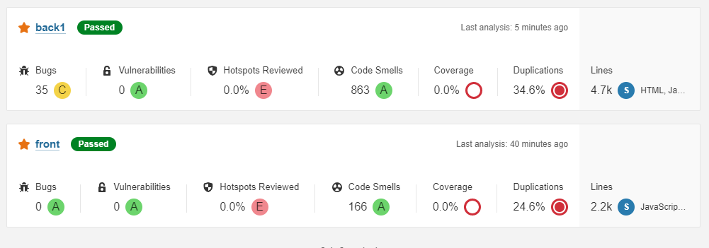

# Analisis en la herrramienta Sonarqube

_Sonarqub es una herramienta que nos ayuda a verificar la utlididad de nuestro codigo tanto en frontend y en backend, aunque tambien se podria hacer un analisis global de todo el proyecto._

_Esta herramienta nos muestras varia informacion util ya que siempre hay cosas que debemos mejorar y esta herramienta nos la marca y nos dice porque esta mal, que esta mal y soluciones para este problema_

_Resultados de los analisis realizados de nuestro backend y fronted_

